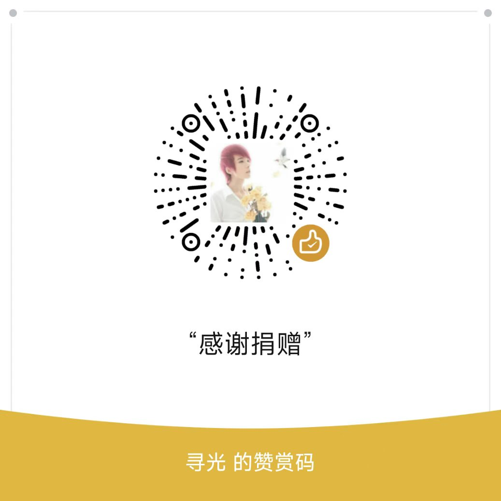

# DERPer Docker

一键部署自建 [Tailscale](https://tailscale.com) DERP 中继服务器，提升 异地组网 网络的直连体验。镜像已自动编译并推送到镜像仓库，服务器上只需要 `docker compose pull` 和 `docker compose up -d`，不需要安装 Go、Docker Buildx 或在本机编译。

DERPer 来自 Tailscale 官方 Go 包：`tailscale.com/cmd/derper`。

## 目录

- [服务器选购](#服务器选购)
- [服务器部署](#服务器部署)
- [DNS 和防火墙](#dns-和防火墙)
- [Tailscale 配置示例](#tailscale-配置示例)
- [启用 DERPer 客户端认证](#启用-derper-客户端认证)
- [共享给朋友使用](#共享给朋友使用)
- [常见注意事项](#常见注意事项)
- [赞助与支持](#赞助与支持)

## 服务器选购

DERPer 需要一个拥有公网 IP 的云服务器。它的配置要求不高，入门机型即可稳定运行：

| 项目 | 建议 |
|---|---|
| CPU / 内存 | 1 核 1G 起，2 核 2G 更从容 |
| 带宽 | 个人/小团队 1~5 Mbps 即可；人越多越需要提升带宽 |
| 系统 | Debian 12 / Ubuntu 22.04+ 优先，也兼容 CentOS / Rocky |
| 网络 | 必须有公网 IP；国内机器拉取 GHCR 较慢时可配置 Docker 镜像加速器 |
| 防火墙 | 需放行 DERP HTTPS 端口和 STUN UDP 端口，见「DNS 和防火墙」 |

> DERPer 是轻量 Go 服务，瓶颈通常在带宽而非 CPU，选购时优先关注带宽和流量。

常用服务器提供商：

[雨云](https://www.rainyun.com/MTYyODg0_?s=derper_docker)</br>
[腾讯云](https://curl.qcloud.com/pZHOvVMy)</br>
[阿里云](https://www.aliyun.com/minisite/goods?userCode=xhg48xsu)</br>


## 服务器部署

### 傻瓜式安装引导

推荐首次部署直接使用交互式安装脚本（无需 clone 整个仓库）：

```bash
curl -fsSL https://raw.githubusercontent.com/DYS7516461/derper-docker/main/install.sh -o install.sh
bash install.sh
```

如果无法直接访问 GitHub，脚本会自动尝试多个镜像站下载 docker-compose 配置文件；也可以改用加速站获取安装脚本：

```bash
curl -fsSL https://ghfast.top/https://raw.githubusercontent.com/DYS7516461/derper-docker/main/install.sh -o install.sh
bash install.sh
```

脚本会一步一步询问：

- DERPer 域名，例如 `derp.example.com`。
- Docker 镜像地址；默认使用 `ghcr.io/dys7516461/derper-docker:latest`，fork 用户可通过环境变量 `DERPER_INSTALL_REPO` 切换为自己的仓库，或在脚本中直接输入镜像地址。
- 使用 `host` 还是 `bridge` 网络，Linux 服务器推荐 `host`。
- 证书模式，宝塔/nginx 已占用 `80/443` 时推荐 `manual`。
- DERP HTTPS 端口，例如 `4443`。
- STUN UDP 端口，例如 `3478`。
- 是否启用 `DERP_VERIFY_CLIENTS` 客户端认证。

如果服务器安装了宝塔面板，并且已经为当前域名申请证书，脚本会自动识别：

```text
/www/server/panel/vhost/cert/<你的域名>/fullchain.pem
/www/server/panel/vhost/cert/<你的域名>/privkey.pem
```

如果没有识别到宝塔证书，脚本会让你手动输入 `fullchain.pem` 和 `privkey.pem` 的实际路径。

脚本还会检测 Docker、Docker Compose；如果缺失，会询问是否使用 Docker 官方安装脚本安装。启用客户端认证时，脚本也会检测 Tailscale，并在需要时引导安装和登录。

所需的 docker-compose 配置文件（根据你选择的网络/证书模式而定）会自动下载到当前目录；如果你已经 clone 了仓库（目录中已有这些文件），脚本会直接使用本地文件，不会重复下载。每个下载地址按顺序尝试直连和多个 GitHub 镜像站，全部失败时会打印文件链接，由你手动下载后放到当前目录，再重新运行脚本即可。

部署完成后，脚本会在当前项目目录生成：

```text
.env
derpMap.hujson
```

`.env` 是当前服务器部署配置；`derpMap.hujson` 是可以复制到 Tailscale policy file 的自定义 DERP 配置。它们已经加入 `.gitignore`，避免误提交个人域名、IP 或证书路径。

宝塔/nginx 继续占用 `80/443`，DERPer 直接开放非标准端口时，通常只需要额外放行：

```text
TCP 4443
UDP 3478
```

生成的 `derpMap.hujson` 里也会自动使用你选择的端口。

非交互 dry-run 示例：

```bash
DERPER_INSTALL_NONINTERACTIVE=1 \
DERPER_INSTALL_DRY_RUN=1 \
DERPER_INSTALL_HOSTNAME=derp.example.com \
DERPER_INSTALL_CERT_MODE=manual \
DERPER_INSTALL_CERT_FULLCHAIN=/path/to/fullchain.pem \
DERPER_INSTALL_CERT_PRIVKEY=/path/to/privkey.pem \
DERPER_INSTALL_HTTPS_PORT=4443 \
DERPER_INSTALL_STUN_PORT=3478 \
bash install.sh --non-interactive --dry-run
```

### 手动部署

不想用交互式脚本时，也可以手动操作。先下载所需文件（下载失败的链接可直接用浏览器打开）：

```bash
# 下载环境变量模板与默认 compose 文件（host 网络）
curl -fsSL https://raw.githubusercontent.com/DYS7516461/derper-docker/main/.env.example -o .env.example
curl -fsSL https://raw.githubusercontent.com/DYS7516461/derper-docker/main/docker-compose.yml -o docker-compose.yml
```

复制环境变量模板：

```bash
cp .env.example .env
```

编辑 `.env`：

```dotenv
DERP_HOSTNAME=derp.example.com
DERPER_IMAGE=ghcr.io/dys7516461/derper-docker:latest
TZ=Asia/Shanghai
```

> 镜像由 GitHub Actions 自动构建发布，fork 后可以用自己的镜像地址。

默认使用 host 网络：

```bash
docker compose up -d
```

更新镜像：

```bash
docker compose pull
docker compose up -d
```

### Host 网络模式

默认 `docker-compose.yml` 使用 host 网络。适合 Linux 服务器，端口映射最少，STUN UDP 行为也更直接。

```bash
docker compose -f docker-compose.yml up -d
```

### Bridge 网络模式

如果你不能使用 host 网络，可以使用 bridge 模式：

```bash
docker compose -f docker-compose.bridge.yml up -d
```

默认映射：

```text
80/tcp    -> Let's Encrypt HTTP 验证
443/tcp   -> DERP HTTPS
3478/udp  -> STUN
```

Let's Encrypt 证书会保存在 Docker volume `derper-certs` 中，容器重建后不会丢失。

### 服务器 80 和 443 已被 nginx 占用

DERP 不建议放在普通 HTTP 反向代理后面，例如 nginx `location` + `proxy_pass`。DERP 客户端会先建立 TLS 连接，然后在连接内部升级到 DERP 自己的双向协议；普通 HTTP 反代很容易破坏这个连接。

遇到 nginx 已经占用 TCP `80` 和 `443` 时，建议按下面优先级选择。

#### 方案 A：DERPer 使用非标准 HTTPS 端口

这是最简单、最稳的共存方式：nginx 继续使用 `80/443`，DERPer 使用例如 `8443/tcp`，STUN 仍使用 `3478/udp`。

`.env` 示例：

```dotenv
DERP_HOSTNAME=derp.example.com
DERP_CERT_MODE=manual
DERP_CERT_FULLCHAIN=/etc/letsencrypt/live/derp.example.com/fullchain.pem
DERP_CERT_PRIVKEY=/etc/letsencrypt/live/derp.example.com/privkey.pem
DERP_HTTP_PORT=-1
DERP_HTTPS_PORT=8443
DERP_STUN_PORT=3478
```

`DERP_CERT_MODE=manual` 表示 DERPer 不再自己申请 Let's Encrypt 证书。你需要用 nginx、certbot、acme.sh 或 DNS-01 先为 `DERP_HOSTNAME` 申请证书，然后让容器能读到这两个文件：

```text
/var/lib/derper/certs/derp.example.com.crt
/var/lib/derper/certs/derp.example.com.key
```

宿主机上的证书文件可以继续叫 `fullchain.pem` 和 `privkey.pem`，不需要重命名；只要在 Docker 挂载时把它们映射成容器内的 `<DERP_HOSTNAME>.crt` 和 `<DERP_HOSTNAME>.key` 即可。

仓库已经提供 `docker-compose.manual-cert.yml`，会把 `.env` 中的 `DERP_CERT_FULLCHAIN` 和 `DERP_CERT_PRIVKEY` 挂载到 DERPer 需要的位置：

```yaml
services:
  derper:
    volumes:
      - ${DERP_CERT_FULLCHAIN}:/var/lib/derper/certs/${DERP_HOSTNAME}.crt:ro
      - ${DERP_CERT_PRIVKEY}:/var/lib/derper/certs/${DERP_HOSTNAME}.key:ro
```

如果你的证书放在其他目录，把 `.env` 里的 `DERP_CERT_FULLCHAIN` 和 `DERP_CERT_PRIVKEY` 换成实际路径即可。

然后启动：

```bash
docker compose -f docker-compose.yml -f docker-compose.manual-cert.yml up -d
```

此时 tailnet policy file 里的 DERP 节点也要写 `DERPPort: 8443`：

```json
{
  "Name": "901a",
  "RegionID": 901,
  "HostName": "derp.example.com",
  "DERPPort": 8443,
  "STUNPort": 3478
}
```

防火墙需要放行 TCP `8443` 和 UDP `3478`。TCP `80/443` 继续留给 nginx。

#### 方案 B：nginx stream 按 SNI 做 TCP 透传

如果你必须让 DERP 也使用公网 `443/tcp`，可以把 nginx 的 `443` 改成 stream 四层入口，根据 SNI 把 `derp.example.com` 透传给 DERPer，把其他域名透传给原来的 HTTPS 站点。

思路示例：

```nginx
stream {
    map $ssl_preread_server_name $backend {
        derp.example.com derper_backend;
        default web_backend;
    }

    upstream derper_backend {
        server 127.0.0.1:8443;
    }

    upstream web_backend {
        server 127.0.0.1:4443;
    }

    server {
        listen 443;
        proxy_pass $backend;
        ssl_preread on;
    }
}
```

这种方式不是 HTTP 反代，而是 TCP 透传，TLS 仍由 DERPer 自己处理。原有 nginx HTTPS 站点需要从公网 `443` 改到内部端口，例如 `127.0.0.1:4443`。如果你不熟悉 nginx `stream`，优先使用方案 A 或单独服务器/IP。

#### 方案 C：单独服务器或单独公网 IP

如果可以给 DERPer 一台单独服务器，或者给同一台服务器增加一个单独公网 IP，让 DERPer 独占该 IP 的 `80/443/3478` 是最省心的方案。这样可以继续使用默认 `DERP_CERT_MODE=letsencrypt`，也不用改 nginx 的现有站点。

## DNS 和防火墙

请确保：

- `DERP_HOSTNAME` 的 A/AAAA 记录指向服务器公网 IP。
- TCP `80` 对公网开放，用于 Let's Encrypt HTTP 验证。
- TCP `443` 对公网开放，用于 DERP。
- UDP `3478` 对公网开放，用于 STUN。

如果服务器前面有安全组、防火墙或云厂商 ACL，需要同时放行这些端口。

## Tailscale 配置示例

在 tailnet policy file 中加入自定义 `derpMap`，示例：

```json
{
  "derpMap": {
    "Regions": {
      "901": {
        "RegionID": 901,
        "RegionCode": "custom-cn",
        "RegionName": "Custom China DERP",
        "Nodes": [
          {
            "Name": "901a",
            "RegionID": 901,
            "HostName": "derp.example.com",
            "DERPPort": 443,
            "STUNPort": 3478
          }
        ]
      }
    }
  }
}
```

把 `derp.example.com` 换成你的 `DERP_HOSTNAME`。

## 启用 DERPer 客户端认证

默认 `DERP_VERIFY_CLIENTS=false` 时，只要别人知道你的 `derpMap`，理论上就可以尝试连接这个 DERPer。想限制为指定用户或指定 tailnet 成员，需要启用 DERPer 的客户端验证：

```dotenv
DERP_VERIFY_CLIENTS=true
```

客户端验证依赖宿主机上的 `tailscaled`。它不是 HTTP Basic Auth，也不是用户名密码认证；DERPer 会通过本机 Tailscale LocalAPI 校验连接过来的 Tailscale 节点是否属于本机 `tailscaled` 可见的 tailnet。

启用步骤：

1. 在 DERPer 宿主机安装并登录 Tailscale：

```bash
tailscale up
```

2. 建议把这台 DERPer 主机打上专用 tag，例如 `tag:derper`，方便用 ACL 控制哪些用户或设备能“看见”它。

3. 使用带 socket 挂载的 compose override 启动：

```bash
docker compose -f docker-compose.yml -f docker-compose.verify-clients.yml up -d
```

如果使用 bridge 网络，也可以组合：

```bash
docker compose -f docker-compose.bridge.yml -f docker-compose.verify-clients.yml up -d
```

4. 在 Tailscale policy file 中只允许指定用户访问这台 DERPer 主机。Tailscale 现在推荐新配置使用 `grants`，示例：

```json
{
  "groups": {
    "group:derp-users": [
      "alice@example.com",
      "bob@example.com"
    ]
  },
  "tagOwners": {
    "tag:derper": ["autogroup:admin"]
  },
  "grants": [
    {
      "src": ["group:derp-users"],
      "dst": ["tag:derper"],
      "ip": ["*"]
    }
  ]
}
```

如果你的 policy file 里已有类似允许所有成员访问所有设备的宽泛 `grants` 或旧版 `acls` 规则，所有成员可能仍然能被 DERPer 验证通过。要实现“指定用户才可以使用”，需要避免这些宽泛规则覆盖 `tag:derper`。

## 共享给朋友使用

共享自建 DERPer 时，先区分朋友是否在你的 tailnet 里。

### 朋友加入你的 tailnet

这是最适合“指定用户”的方式：

1. 邀请朋友加入你的 tailnet，或让朋友的设备以你允许的账号登录。
2. 在 policy file 中把朋友账号加入 `group:derp-users`。
3. 保持 `DERP_VERIFY_CLIENTS=true`。
4. 在你的 tailnet policy file 中发布上面的 `derpMap`。

这样只有 policy file 允许的用户或设备可以通过验证并使用这个 DERPer。

### 朋友使用自己的 tailnet

如果朋友使用的是他自己的 tailnet，他也需要在自己的 tailnet policy file 中添加同样的 `derpMap`。但是需要注意：`DERP_VERIFY_CLIENTS=true` 只能验证 DERPer 宿主机本机 `tailscaled` 所在 tailnet 中可见的节点，不能直接验证另一个独立 tailnet 的成员。

因此跨 tailnet 共享通常有三个选择：

- 不开启客户端验证，只把 `derpMap` 给朋友；这最简单，但不是“指定用户”。
- 为朋友单独部署一套 DERPer，并让那台 DERPer 宿主机登录朋友自己的 tailnet。
- 让朋友加入你的 tailnet，然后按上一节用 ACL 指定用户。

如果目标是“只给几个朋友用，并且不公开给陌生人”，推荐让朋友加入你的 tailnet，再开启 `DERP_VERIFY_CLIENTS=true` 和 policy file 分组。

## 开发者

镜像构建、GitHub Actions 发版流程、Secrets 配置与本地测试构建等内容见 [DEVELOPMENT.md](DEVELOPMENT.md)。

## 常见注意事项

- `latest` 适合个人服务器自动跟随最新发布；生产环境也可以固定到 `v1.86.2` 这类版本 tag。
- 首次启动时 DERPer 会根据 `--certmode=letsencrypt` 自动申请证书，前提是 DNS 和 TCP `80` 已经正确开放。
- DERP 协议会在 TLS 内部切换到自定义双向协议，不适合放在普通 HTTP 反向代理后面；推荐让 DERPer 直接监听公网 `443/tcp`。
- 国内服务器拉取 GHCR 较慢时，可以配置 Docker 镜像加速器或使用代理。
- 公共开源用户可以直接使用 GHCR 镜像地址。

## 赞助与支持

如果这个项目帮到了你，欢迎赞助一杯咖啡 ☕，支持持续维护：

[爱发电](https://ifdian.net/a/seekray)</br>



> 所有赞助将用于服务器、域名和开发维护。感谢每一位支持者！
